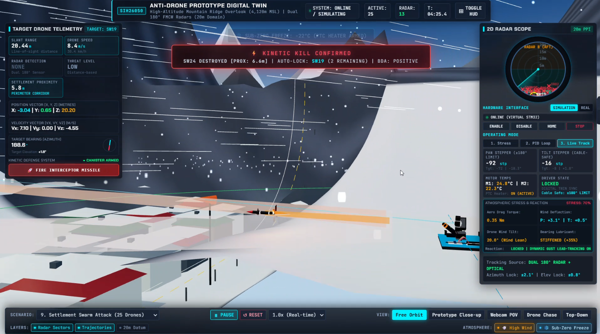
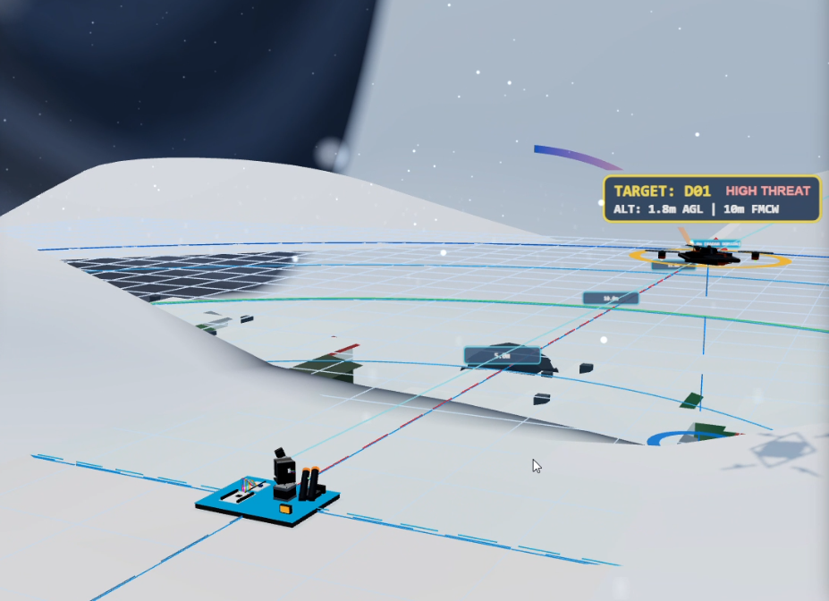
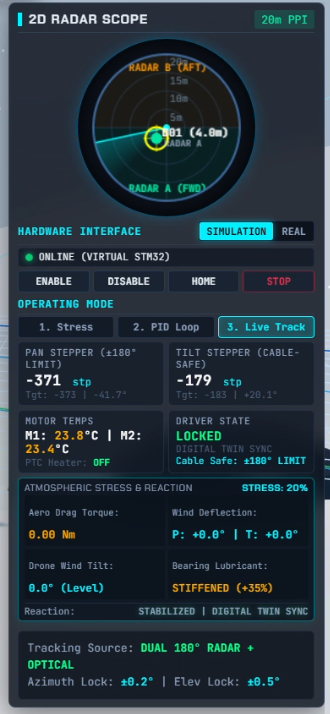
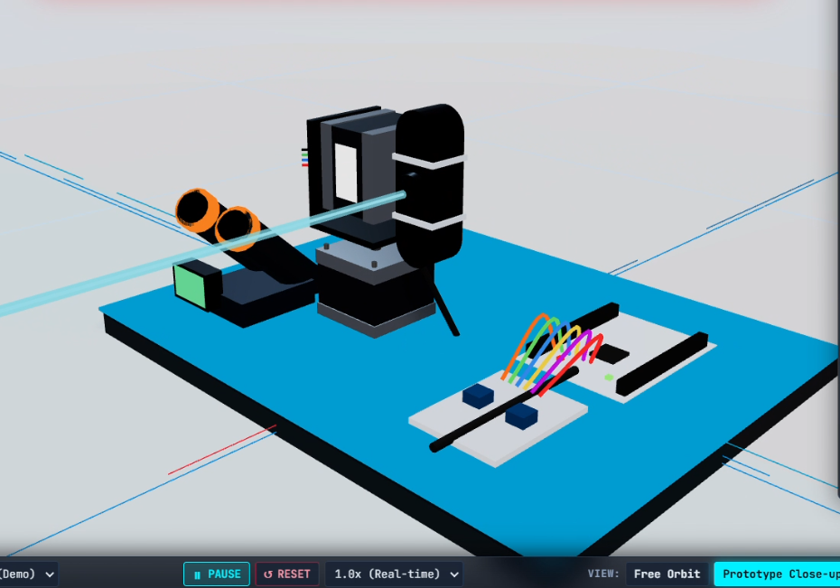
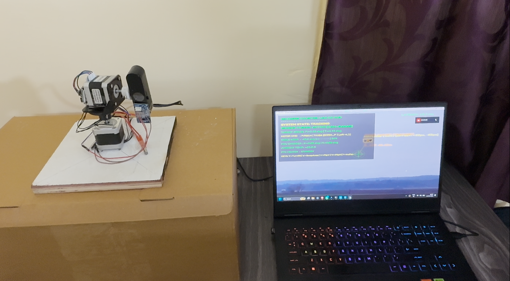
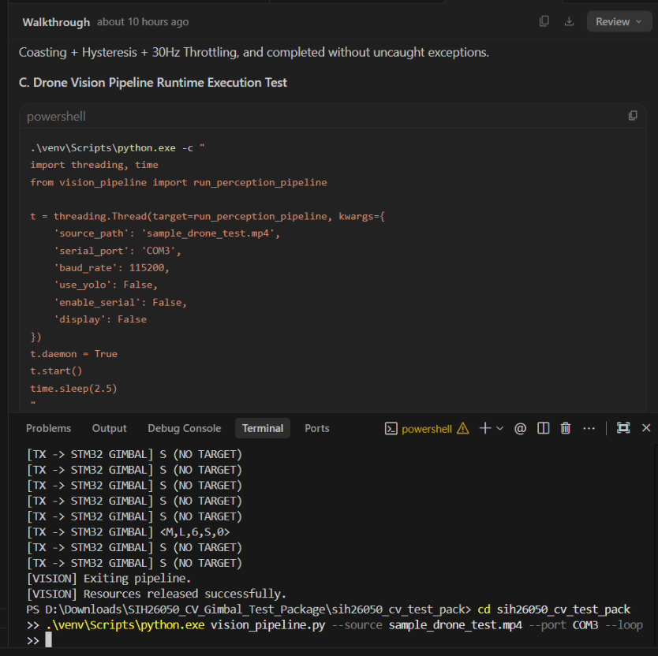
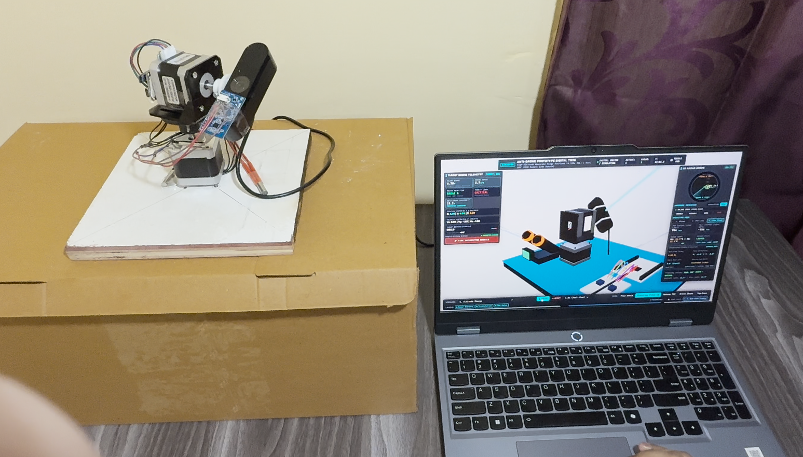

# SIH 2026 — Anti-Drone System

<p align="center">
  
</p>

<h3 align="center">High-Altitude Robust Anti-Drone System</h3>

<p align="center">
  Radar • Computer Vision • Sensor Fusion • Embedded Control • Precision Gimbal • 3D Simulation • HIL
</p>

<p align="center">
  <b>Smart India Hackathon 2026 · SIH26050 · DRDO</b>
</p>

---

## Overview

This project is a modular **anti-drone detection, tracking and precision-pointing system** developed for **Smart India Hackathon 2026 — SIH26050**.

The system combines radar awareness, camera-based computer vision, target tracking, STM32 embedded control, precision PAN/TILT actuation, and a real-time simulation environment.

A Hardware-in-the-Loop (HIL) workflow connects the simulated environment with the embedded controller, allowing system behaviour to be tested across software and hardware layers.

### Core Pipeline

```text
        RADAR                         CAMERA
          │                             │
          │                             ▼
          │                       ┌───────────┐
          └──────────────────────►│ Detection │
                                  └─────┬─────┘
                                        │
                                        ▼
                                  Target Tracking
                                        │
                                        ▼
                                  Control System
                                        │
                                        ▼
                                      STM32
                                        │
                                        ▼
                                  2-Axis Gimbal
                                        │
                                        ▼
                                  Target Pointing
```

---

# System Demonstration

## Real-Time 3D Simulation

<p align="center">
  
</p>

The simulation provides a real-time environment for representing the system, target and surrounding environment.

It is used to visualize system behaviour and test the tracking and control pipeline in a controlled environment.

---

## Target Tracking

<p align="center">
  
</p>

The tracking view demonstrates the simulated target-tracking workflow and provides a visual representation of system response.

---

## Radar Simulation

<p align="center">
  
</p>

The radar simulation provides dedicated views for observing radar-related information and different simulation states.

The radar layer acts as an independent sensing source for target awareness.

---

## Simulation Prototype

<p align="center">
  
</p>

A close-up view of the developed simulation prototype.

---

# Computer Vision

The computer-vision subsystem provides camera-based target detection and tracking.

```text
Camera
  │
  ▼
Frame Acquisition
  │
  ▼
YOLO Detection
  │
  ├── Bounding Box
  ├── Confidence
  └── Target Position
  │
  ▼
Target Tracking
  │
  ▼
Control Pipeline
```

## Hardware Tracking

<p align="center">
  
</p>

The hardware-tracking view demonstrates the computer-vision pipeline operating as part of the integrated system.

---

## Computer Vision Terminal

<p align="center">
  
</p>

The terminal view provides visibility into the computer-vision processing and detection workflow.

---

# Radar

Radar provides an independent sensing layer for target awareness.

```text
Radar
  │
  ├── Target Bearing
  ├── Target Range
  └── Target Detection
          │
          ▼
      Target State
          │
          ▼
    Tracking System
```

---

# Precision Gimbal

The pointing subsystem uses a **2-axis PAN/TILT mechanism**.

```text
Target Position
      │
      ▼
 Angular Error
      │
      ▼
  Controller
      │
      ▼
 PAN / TILT
      │
      ▼
   STM32
      │
      ▼
   Gimbal
```

The control layer converts target-position information into pointing commands for the actuation system.

---

# Embedded Hardware

The embedded control layer is based around an **STM32 microcontroller**.

## PCB and STM32

<p align="center">
  
</p>

The hardware layer contains the PCB and STM32-based embedded control components used for system integration.

---

# Hardware-in-the-Loop

Hardware-in-the-Loop connects the simulation environment with the embedded controller.

<p align="center">
  
</p>

### HIL Architecture

```text
             SIMULATION
                  │
                  ▼
        Target / Environment
                  │
                  ▼
           Control Command
                  │
                  ▼
                STM32
                  │
                  ▼
            Gimbal / Motor
                  │
                  ▼
               Feedback
                  │
                  └──────────────► Simulation
```

This allows the embedded control layer to interact with simulated system conditions before complete physical integration.

---

# Communication Interface

The system uses a structured serial communication format between the higher-level software and the STM32 controller.

### Command Format

```text
X{pan}Y{tilt}Z{distance}
```

### Example

```text
X12.5Y-5.2Z1500.0
```

### Telemetry

```text
PAN:12.5,TILT:-5.2,TEMP:34.2,STATUS:TRACKING
```

---

# Operating Modes

### Mock / Simulation

```bash
python main.py --mock
```

Runs the dashboard using simulated subsystem data.

### Camera + Computer Vision

```bash
python main.py --mock --camera 1
```

Uses a real camera while retaining simulated components.

### Test Video

```bash
python main.py --mock --video <video-path>
```

Runs the computer-vision pipeline against recorded footage.

### Hardware

```bash
python main.py
```

Uses the configured physical interfaces.

---

# Technology Stack

| Subsystem | Technology |
|---|---|
| Computer Vision | Python · OpenCV · YOLO |
| Dashboard | Python · PySide6 |
| Embedded Control | STM32 |
| Communication | UART / Serial |
| Simulation | Three.js · WebGL |
| Control | PID · Closed-loop control |
| Hardware | PCB · Sensors · Actuators |
| Mechanical | PAN/TILT Gimbal |
| Version Control | Git |

---

# Repository Structure

```text
SIH-26-Anti-Drone-System/
│
├── dashboard/                  # Operator dashboard
├── vision/                     # Computer vision
├── radar/                      # Radar subsystem
├── gimbal/                     # Gimbal and control
├── firmware/                   # Embedded firmware
├── simulation/                 # Real-time 3D simulation
├── hardware/                   # Electronics and wiring
├── mechanical/                 # Mechanical design
├── docs/
│   └── images/                 # Project images
└── tests/                      # Testing
```

---

# Quick Start

```bash
git clone https://github.com/Buddhadeb-ss/SIH-26-Anti-Drone-System.git
cd SIH-26-Anti-Drone-System
```

## Dashboard

```bash
cd dashboard
pip install -r requirements.txt
python main.py --mock
```

## Simulation

The simulation is located in:

```text
simulation/
```

It can be run independently for interactive system-level visualization and testing.

---

# Engineering Approach

```text
              SENSING
          Radar + Camera
                │
                ▼
            PERCEPTION
         Detection + Tracking
                │
                ▼
              CONTROL
               STM32
                │
                ▼
             ACTUATION
             PAN / TILT
                │
                ▼
            VALIDATION
          Simulation + HIL
```

The separation between sensing, perception, control and actuation allows individual components to be developed and tested while maintaining the interfaces required for complete system integration.

---

# Project Highlights

- **Multi-sensor architecture** combining radar and camera-based perception
- **Computer vision** for target detection and tracking
- **STM32 embedded control** for hardware integration
- **2-axis PAN/TILT gimbal** for precision pointing
- **Real-time 3D simulation** for system-level visualization
- **PID closed-loop control** for gimbal response
- **Hardware-in-the-Loop testing** connecting simulation and embedded hardware
- **Modular repository structure** for independent subsystem development

---

# Project Context

**Smart India Hackathon 2026**

**Problem Statement:** SIH26050

**Organization:** DRDO

**Domain:** High-Altitude Performance Optimization & Robust Design of Anti-Drone System

### Overall System

```text
Detection
    ↓
Tracking
    ↓
Precision Pointing
    ↓
Embedded Control
    ↓
Simulation
    ↓
HIL Validation
```

---

# License

This project is licensed under the [MIT License](./LICENSE).

---

<p align="center">
  <b>Built for SIH 2026 · SIH26050</b>
</p>
